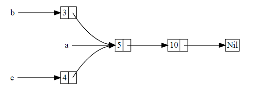

# `Rc<T>`, the Reference Counted Smart Pointer

In the majority of cases, ownership is clear: you know exactly which variable owns a given value. However, there are cases when a single value might have multiple owners. 
> For example, in graph data structures, multiple edges might point to the same node, and that node is conceptually owned by all of the edges that point to it. A node shouldn’t be cleaned up unless it doesn’t have any edges pointing to it and so has no owners.

You have to enable multiple ownership explicitly by using the Rust type `Rc<T>`, which is an abbreviation for *reference counting*. The `Rc<T>` type keeps track of the number of references to a value to determine whether or not the value is still in use. If there are zero references to a value, the value can be cleaned up without any references becoming invalid.

> We use the `Rc<T>` type when we want to allocate some data on the heap for multiple parts of our program to read and we can’t determine at compile time which part will finish using the data last. If we knew which part would finish last, we could just make that part the data’s owner, and the normal ownership rules enforced at compile time would take effect.

* ⭐Note that `Rc<T>` is only for use in single-threaded scenarios.

# Using `Rc<T>` to Share Data

We try to visualize a list structure as the following:



We continue to use the previous defined enum `List` to create the above structure programatically:

```rust
enum List {
    Cons(i32, Box<List>),
    Nil,
}
use crate::List::{ Cons, Nil };
fn main() {
    let a = Cons(5, Box::new(Cons(10, Box::new(Nil))));
    let b = Cons(3, Box::new(a));
    let c = Cons(4, Box::new(a)); // ❌ WON'T COMPILE
}
```

When we compile this code, we get this error:

```txt
   Compiling cons-list v0.1.0 (file:///projects/cons-list)
error[E0382]: use of moved value: `a`
  --> src/main.rs:11:30
   |
9  |     let a = Cons(5, Box::new(Cons(10, Box::new(Nil))));
   |         - move occurs because `a` has type `List`, which does not implement the `Copy` trait
10 |     let b = Cons(3, Box::new(a));
   |                              - value moved here
11 |     let c = Cons(4, Box::new(a));
   |                              ^ value used here after move
```

* Since `b` already owns `a`, that is, `a` is already moved. Thus `c` cannot have it anymore.

> In this specifci case, we could change the definition of `Cons` to hold references instead, but then we would have to specify lifetime parameters. By specifying lifetime parameters, we would be specifying that every element in the list will live at least as long as the entire list.

Or, we could use `Rc<T>` in place of `Box<T>`:

```rust
enum List {
    Cons(i32, Rc<List>),
    Nil,
}
use crate::List::{ Cons, Nil };
use std::rc::Rc;
fn main() {
    let a = Rc::new(Cons(5, Rc::new(Cons(10, Rc::new(Nil)))));
    let b = Cons(3, Rc::clone(&a));
    let c = Cons(4, Rc::clone(&a));
}
```

> We could have called `a.clone()` rather than `Rc::clone(&a)`, but Rust’s convention is to use `Rc::clone` in this case.

* The implementation of `Rc::clone` doesn’t make a deep copy of all the data like most types’ implementations of `clone` do. The call to `Rc::clone` only increments the reference count, which doesn’t take much time.
