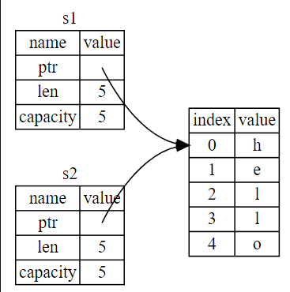
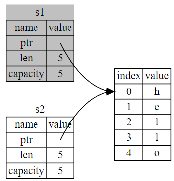

# Scope

As a first example of ownership, we’ll look at the scope of some variables. A scope is the range within a program for which an item is valid. Take the following variable:
```rust
{                      // s is not valid here, it’s not yet declared
    let s = "hello";   // s is valid from this point forward
    // do stuff with s
}                      // this scope is now over, and s is no longer valid
```
The variable `s` refers to a string literal, where the value of the string is hardcoded into the text of our program. At this point, the relationship between scopes and when variables are valid is similar to that in other programming languages. Now we’ll build on top of this understanding by introducing the `String` type.

## The `String` Type
To illustrate the rules of ownership, we need a data type that is more complex than those we covered in [2.4 Data Types](../2.%20Basics/2.4%20Data%20Types.md). The `String` type will be talked in details in later chapters.

> The types covered previously are of a known size, can be stored on the stack and popped off the stack when their scope is over, and can be quickly and trivially copied to make a new, independent instance if another part of code needs to use the same value in a different scope. But we want to look at data that is stored on the heap and explore how Rust knows when to clean up that data, and the String type is a great example.

A string value is hardcoded into our program. String literals are convenient, but they aren’t suitable for every situation in which we may want to use text:
1. One reason is that they’re immutable. 
2. Another is that not every string value can be known when we write our code.

The `String` type manages data allocated on the heap and as such is able to store an amount of text that is unknown to us at compile time. You can create a `String` from a string literal using the `from` function, like so:
```rust
let s = String::from("hello");
s.push_str(", world!"); // push_str() appends a literal to a String, it's mutable
println!("{}", s); // This will print `hello, world!`
```

With the `String` type, in order to support a mutable, growable piece of text, we need to allocate an amount of memory on the heap, unknown at compile time, to hold the contents. This means:
* The memory must be requested from the memory allocator at runtime.
* Need a way of returning this memory to the allocator when we’re done with our `String`.

That first part is done by us: when we call `String::from`, its implementation requests the memory it needs. This is pretty much universal in programming languages.

> However, the second part is different. In languages with a `garbage collector` (GC), the GC keeps track of and cleans up memory that isn’t being used anymore, and we don’t need to think about it. In most languages without a GC, it’s our responsibility to identify when memory is no longer being used and to call code to explicitly free it, just as we did to request it. Doing this correctly has historically been a difficult programming problem. If we forget, we’ll waste memory. If we do it too early, we’ll have an invalid variable. If we do it twice, that’s a bug too. We need to pair exactly one `allocate` with exactly one `free`.

## `drop` function
Rust takes a different path: the memory is automatically returned once the variable that owns it goes out of scope:
```rust
{
    let s = String::from("hello"); // s is valid from this point forward
    // do stuff with s
}                                  // this scope is now over, and s is no
                                    // longer valid
```

When a variable goes out of scope, Rust calls a special function for us. This function is called `drop`, and it’s where the author of `String` can put the code to return the memory. **Rust calls `drop` automatically at the closing curly bracket**.

> Note: In C++, this pattern of deallocating resources at the end of an item’s lifetime is sometimes called *Resource Acquisition Is Initialization* (RAII). The `drop` function in Rust will be familiar to you if you’ve used RAII patterns.

This pattern has a profound impact on the way Rust code is written. It may seem simple right now, but the behavior of code can be unexpected in more complicated situations when we want to have multiple variables use the data we’ve allocated on the heap. Let’s explore some of those situations now.

# Variables interacting with Move
Multiple variables can interact with the same data in different ways in Rust. Let’s look at the `String` version:
```rust
let s1 = String::from("hello");
let s2 = s1;
```

The `String` type essentially works like a pointer to the memory that holds the contents of the string, a length, and a capacity. This group of data is stored on the stack.

When we assign `s1` to `s2`, the `String` data is copied, meaning we copy the pointer, the length, and the capacity that are on the stack. We do not copy the data on the heap that the pointer refers to:



> This is a problem: when `s2` and `s1` go out of scope, they will both try to free the same memory by calling the function `drop`. This is known as a *double free* error and is one of the memory safety bugs we mentioned previously. Freeing memory twice can lead to memory corruption, which can potentially lead to security vulnerabilities.

To ensure memory safety, after the line `let s2 = s1;`, Rust considers `s1` as **no longer valid**. Therefore, Rust doesn’t need to free anything when `s1` goes out of scope:
```rust
let s1 = String::from("hello");
let s2 = s1;
println!("{}, world!", s1); // ❌ WON'T COMPILE
```
You’ll get a compile-time error like this because Rust prevents you from using the invalidated reference:
```bash
error[E0382]: borrow of moved value: `s1`
 --> src/main.rs:5:28
  |
2 |     let s1 = String::from("hello");
  |         -- move occurs because `s1` has type `String`, which does not implement the `Copy` trait
3 |     let s2 = s1;
  |              -- value moved here
4 | 
5 |     println!("{}, world!", s1);
  |                            ^^ value borrowed here after move
  |
  = note: this error originates in the macro `$crate::format_args_nl` (in Nightly builds, run with -Z macro-backtrace for more info)
```

> ##### Move 
> If you’ve heard the terms *shallow copy* and *deep copy* while working with other languages, the concept of copying the pointer, length, and capacity without copying the data probably sounds like making a shallow copy. But because Rust also invalidates the first variable, instead of being called a shallow copy, it’s known as a **move**.

we would say that `s1` was moved into `s2`. So, what actually happens is shown in the following figure:



That solves our problem! With only `s2` valid, when it goes out of scope it alone will free the memory, and we’re done.
> In addition, there’s a design choice that’s implied by this: Rust will never automatically create “deep” copies of your data. Therefore, any *automatic* copying can be assumed to be inexpensive in terms of runtime performance.

# Stack-Only Data: Copy
There’s another wrinkle we haven’t talked about yet. This code using integers:
```rust
let x = 5;
let y = x;
println!("x = {}, y = {}", x, y);
```
The reason is that types such as integers that have a known size at compile time are stored entirely on the stack, so copies of the actual values are quick to make. That means there’s no reason we would want to prevent `x` from being valid after we create the variable `y`. In other words, there’s no difference between deep and shallow copying here.

> Rust has a special annotation called the `Copy` trait that we can place on types that are stored on the stack, as integers are. If a type implements the `Copy` trait, **variables that use it do not move, but rather are trivially copied**, making them still valid after assignment to another variable. Rust won’t let us annotate a type with `Copy` if the type, or any of its parts, has implemented the `Drop` trait. We'll get a compile-time error.

Here are some of the types that implement Copy:
* All the integer types, such as `u32`.
* The Boolean type, `bool`, with values `true` and `false`.
* All the floating-point types, such as `f64`.
* The character type, `char`.
* Tuples, if they only contain types that also implement `Copy`. For example, `(i32, i32)` implements `Copy`, but `(i32, String)` does not.

# Ownership and Functions
The mechanics of passing a value to a function are similar to those when assigning a value to a variable. Passing a variable to a function will move or copy, just as assignment does:
```rust
fn main() {
    let s = String::from("hello");  // s comes into scope

    takes_ownership(s);             // s's value moves into the function...
                                    // ... and so is no longer valid here

    let x = 5;                      // x comes into scope

    makes_copy(x);                  // x would move into the function,
                                    // but i32 is Copy, so it's okay to still
                                    // use x afterward

} // Here, x goes out of scope, then s. But because s's value was moved, nothing
  // special happens.

fn takes_ownership(some_string: String) { // some_string comes into scope
    println!("{}", some_string);
} // Here, some_string goes out of scope and `drop` is called. The backing
  // memory is freed.

fn makes_copy(some_integer: i32) { // some_integer comes into scope
    println!("{}", some_integer);
} // Here, some_integer goes out of scope. Nothing special happens.
```

## Return Values and Scope
Returning values can also transfer ownership:
```rust
fn main() {
    let s1 = gives_ownership();         // gives_ownership moves its return
                                        // value into s1

    let s2 = String::from("hello");     // s2 comes into scope

    let s3 = takes_and_gives_back(s2);  // s2 is moved into
                                        // takes_and_gives_back, which also
                                        // moves its return value into s3
} // Here, s3 goes out of scope and is dropped. s2 was moved, so nothing
  // happens. s1 goes out of scope and is dropped.

fn gives_ownership() -> String {             // gives_ownership will move its
                                             // return value into the function
                                             // that calls it

    let some_string = String::from("yours"); // some_string comes into scope

    some_string                              // some_string is returned and
                                             // moves out to the calling
                                             // function
}

// This function takes a String and returns one
fn takes_and_gives_back(a_string: String) -> String { // a_string comes into
                                                      // scope

    a_string  // a_string is returned and moves out to the calling function
}
```

The ownership of a variable follows the same pattern every time: assigning a value to another variable moves it. When a variable that includes data on the heap goes out of scope, the value will be cleaned up by `drop` unless ownership of the data has been moved to another variable.

> While this works, taking ownership and then returning ownership with every function is a bit tedious. Luckily for us, Rust has a feature for using a value without transferring ownership, called *references*.