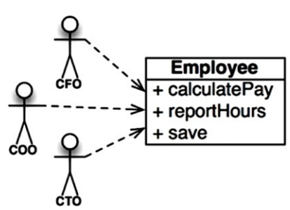

# 单一功能 - Single Responsibility Principle (SRP)

Single-responsibility Principle (SRP) states:

> A module should be responsible to **one and only one reason to change**.

* 这里常见的class在这里并不是特指Object Oriented Programming里特有的概念。最简单直译的意思就是指“source file”。更通俗的理解就是一组互相关联的functions和data structures。
* 这句话常常被误解成：``A module should do one and only one job`. 这两句话背后代表的意义是有很大区别的。

# 违反了SRP的症状

想要正确的理解这个principle，不妨我们来罗列一下违反了SRP的一些症状。

## Symptom 1 - Responsible to Different Actors

Assium there is a class named Employee` and has the following three methods:

* This class violates the SRP because **those three methods are responsible to three very different actors**.
    * The `calculatePay()` method is specified by the accounting department, which reports to the CFO. 
    * The `reportHours()` method is specified and used by the human resources department, which reports to the COO. 
    * The `save()` method is specified by the database administrators (DBAs), who report to the CTO.

* By putting the source code for these three methods into a single `Employee` class, the developers have coupled each of these actors to the others. This **coupling** can cause the actions of the CFO’s team to affect something that the COO’s team depends on.

## Symptom 2 - Merges

It’s not hard to imagine that merges will be common in source files that contain many different methods. This situation is especially likely if those methods are responsible to different actors.

> For example, suppose that the CTO’s team of DBAs decides that there should be a simple schema change to the `Employee` table of the database. Suppose also that the COO’s team of HR clerks decides that they need a change in the format of the hours report.
>
> Two different developers, possibly from two different teams, check out the Employee class and begin to make changes. **Unfortunately their changes collide. The result is a merge**.

# References

* 部分内容借鉴于Uncle Bob写的《架构简洁之道》。