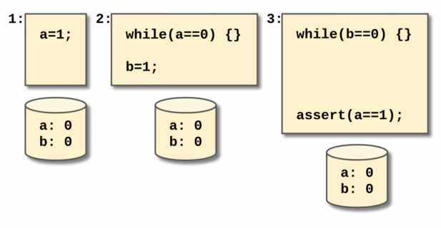
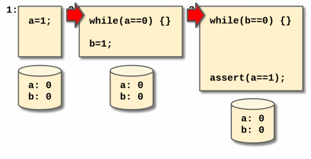
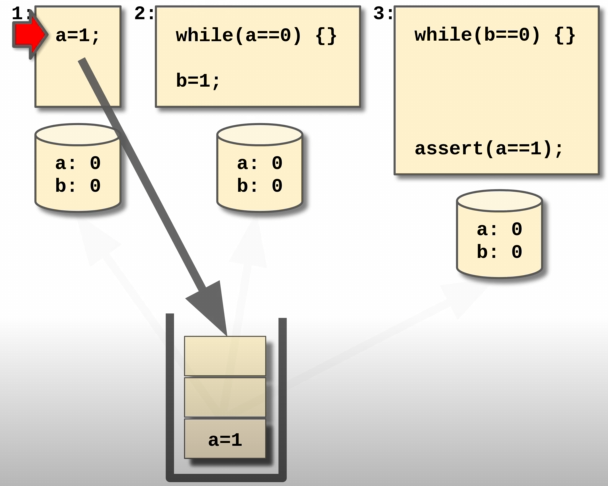
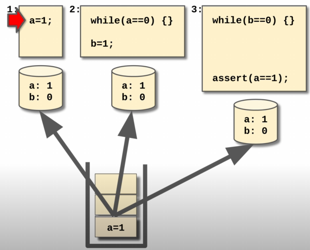
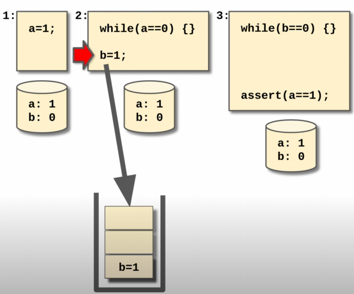
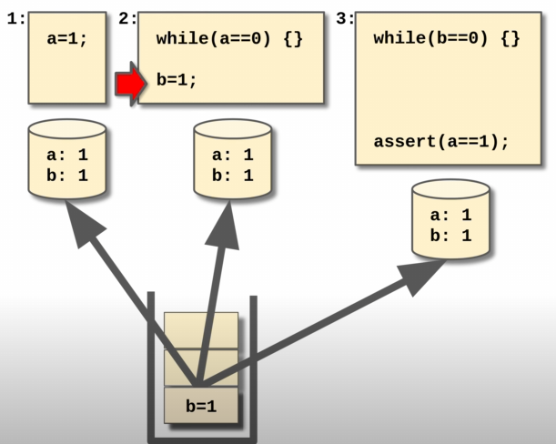

# Sequential Consistency - 顺序一致性

> Sequential Consistency是由Lamport (1979) 提出的，比Strict Consistency更弱一点。

* A write to a variable does not have to be seen instantaneously, however, <u>writes to variables by different processors have to be seen in the same order by all processors</u>.
    * A shared-memory system is said to support the sequential consistency model if: “all processes see the same order of all memory access operations on the shared memory.”

## 案例 - Example

对于一个具有Sequential Consistency的系统来说，考虑以下三个文件的代码：

相较于Strict Consistency假设所有的write都是atomic，在sequential consistency里面，我们可以让每一个process具有自己的“copy of data”（在现实中，每个线程（thread）都拥有自己独立的register就是一个很好的案例）。

我们以这个假设为前提，我们可以让三个process同时跑起来（parallel）：

 当$P_1$进行了操作$a = 1;$的时候，我们将操作放到一个write queue当中：

然后再通过write queue作为一个中转站似的作用，将$a = 1$广播到每一个其他process：

同理，当$P_2$被通知$a = 1;$之后会进行$b = 1$：

我们的write queue也会将操作后的$b$变量的值通知给其他所有的process：

最后，在符合sequential consistency一致性模型之下，该案例的assertion也不会报错。

## 强大的用处

通过上述案例不难看出：对于每一个process：$P_1$, $P_2$, $P_3$来说，每一次write都是<u>有顺序可言</u>的：$a = 1$然后是$b = 1$。

* Sequential consistency很强大，也在distributed system中很常见。
* 因为sequential consistency允许read操作是并行的（parallel），因此效率也会比strict consistency快很多。
* 但如果我们也想要write操作也是并行的呢？

## 和数据库中的关系

* 这个概念和数据库（Database）中的Serializability很相似，但是在这里我们称作为sequential consistency。

# Reference

* https://www.youtube.com/watch?v=Fm8iUFM2iWU&list=RDLVFm8iUFM2iWU&start_radio=1&rv=Fm8iUFM2iWU&t=0
* https://en.wikipedia.org/wiki/Consistency_model

